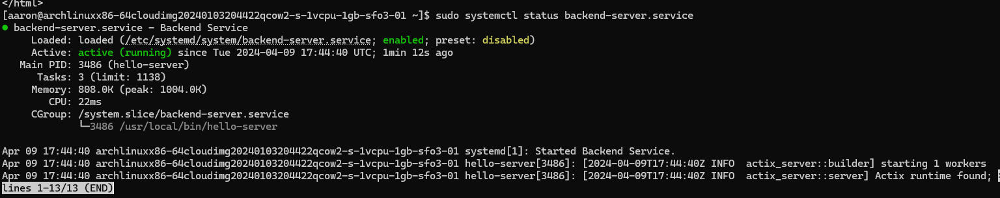

# Assignment 3 Part 2
## Installing UFW
```bash
# Install ufw
sudo pacman -S ufw
# Start the service
sudo systemctl enable --now ufw.service
# --now starts and enable the service now

# check the status of ufw
sudo ufw status verbose
# it should be inactive since it was just installed
```
## Setting up UFW
```bash
# setup ufw by using the commands: allow, deny and limit
# ex sudo ufw allow from 203.0.113.0/24 to any port 22
# ex sudo ufw deny from 203.1.113.4
# ex ufw limit ssh
# allow SSH and http
sudo ufw allow SSH
sudo ufw allow http
# limit SSH 
sudo ufw limit SSH
# now start the firewall
sudo ufw enable 
# finally check the status
sudo ufw status verbose
# it should show the rules of the firewall
```
## Configuring reverse-proxy
```bash
# change directory to /etc/nginx/sites-available
cd /etc/nginx/sites-available
#edit nginx-2420
sudo vim nginx-2420
# copy and paste this at the bottom of the server file
location / {
        # First attempt to serve request as file, then
        # as directory, then fall back to displaying a 404.
        try_files $uri $uri/ =404;
    }

    location /api {
        # Define the reverse proxy settings
        proxy_pass http://127.0.0.1:8080;
        proxy_http_version 1.1;
        proxy_set_header Host $host;
        proxy_set_header X-Real-IP $remote_addr;
        proxy_set_header X-Forwarded-For $proxy_add_x_forwarded_for;
        proxy_set_header X-Forwarded-Proto $scheme;
    }
# save and exit by pressing ESC and typing
:wq
```
## Download backend server file
In terminal use sftp and login to yoour arch vm
sftp -i ~/.ssh/do-key username@ip_address
```bash
# Download the server file from your local machine to remote
put hello-server
# Create a bin directory in home and move the hello-server
mv hello-server /usr/local/bin
# Change permissions to executable
sudo chmod +x hello-server
```
## Create the service file to run the backend
```bash
# Change directory to /etc/systemd/system
cd /etc/systemd/system
# create the service file
sudo vim backend-server.service
# Copy and paste this to the file
[Unit]
Description=Backend Service
After=network.target

[Service]
Type=simple
ExecStart=/usr/bin/hello-server
Restart=always

[Install]
WantedBy=multi-user.target
# Save and exit
# Start the service
sudo systemctl start backend-server.service
# Check the service
